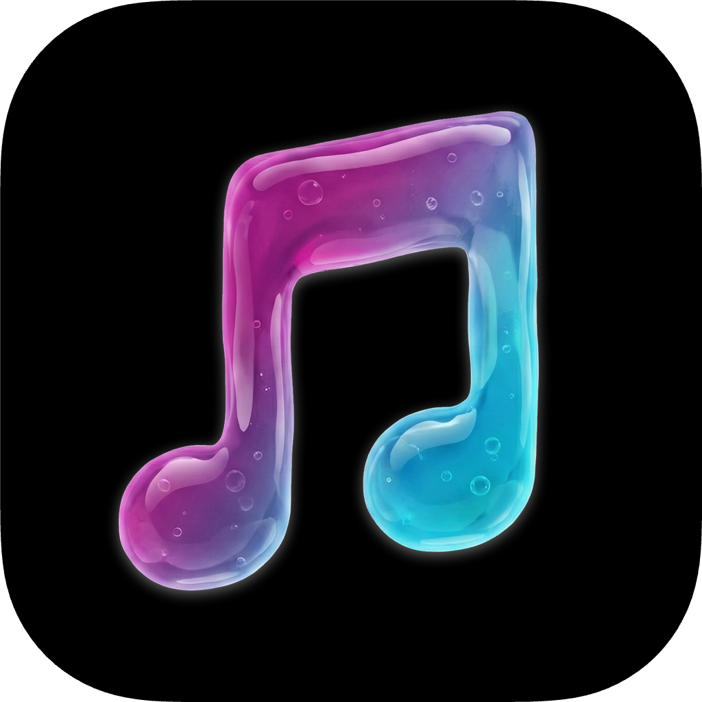

  

  

    <b>Jellytune</b> - a purist Jellyfin music player for iOS
  

  
  
  <!--  -->

### Features

- Pure, minimal, and clean iOS-native design
- Flawless CarPlay, Siri, and AirPlay support
- Gapless playback
- Equalizer (10-band)
- Offline-focused, network-friendly
  - Cache/download only (no streaming)
  - Once a song is listened to, it remains available offline forever
  - Once album art is fetched, it remains available offline forever
  - Fetch/sync data once upon first login, then only manually after that
  - Cache usage visibility (all, by album, and by song)
  - Cache clearing control (all, or by album)
  - Cache quality options (full or transcoded AAC)
- Purist listening functionality
  - Album-focused, you just play an album or a song, and it plays through the rest of the songs in order, as the artist intended

### Purposeful non-features (for now)

- No shuffle, repeat, queuing, etc.
- No playlists, collections, genres, favourites, etc.

### Usage

To support development and get permanent lifetime access to the official build, it will be available for purchase (4.99 USD) on the App Store. There will never be in-app purchases or subscriptions to unlock anything.

To get the app for free, you are encouraged to clone and install on your own iOS device. You can also get it through the TestFlight open beta. Both of these are a great way to find and report bugs!

Please do not clone and redistribute on the App Store as a competitor, as this is just not a nice thing to do.

### FAQ

What is the difference between "Cached" and "Downloaded"?

Cached means the song is available offline, and Downloaded means every song on the entire album is cached and protected from cache clearing.

### Localization

- [x] English
- [x] French
- [x] German
- [ ] Spanish
- [ ] Dutch
- [ ] Swedish
- [ ] Norwegian
- [ ] Finnish
- [ ] Italian
- [ ] Japanese
- [ ] Portuguese (Brazil)
- [ ] Portuguese (Portugal)
- More... 

### Screenshots

#### iPhone

Coming soon...

#### iPad

Coming soon...

#### CarPlay

Coming soon...